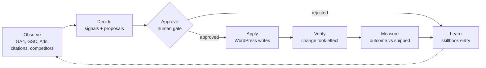
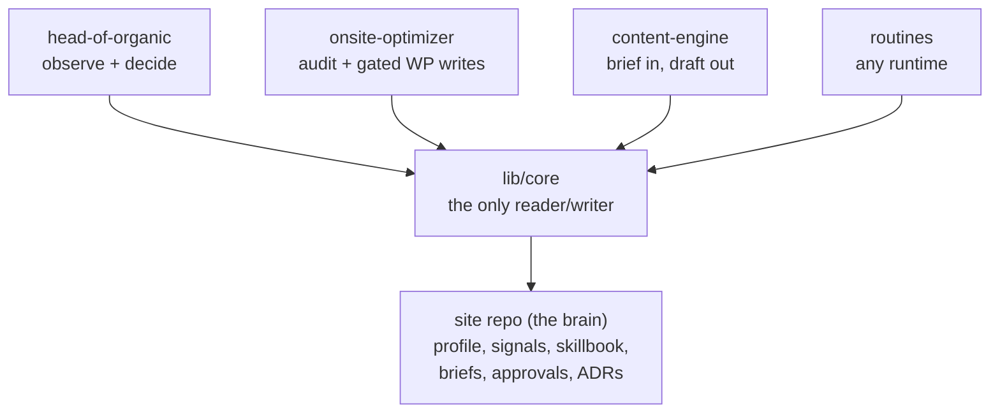
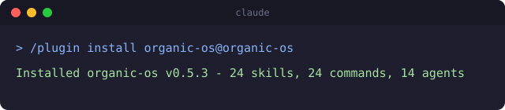
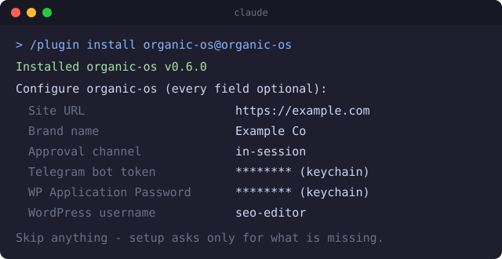

# organic-os

**An always-on organic growth team for your website.** It watches your search
and AI-answer performance, proposes work with the reasoning attached, applies
the changes you approve to WordPress, verifies they actually landed, and
learns from what moved. You approve every change - the gate is enforced in
code, not by trust.

Free and open source (MIT). A Claude plugin: no server, no database, no
account, no telemetry.

[](https://github.com/shalintripathi/organic-os/actions/workflows/ci.yml)
[](https://github.com/shalintripathi/organic-os/releases)
[](LICENSE)


## Install

```
/plugin marketplace add shalintripathi/organic-os
/plugin install organic-os@organic-os
```

Works identically on Claude Code CLI and Claude Cowork. Prerequisite:
Python 3.9+ with PyYAML (`python3 -m pip install --user pyyaml`).

Then run `/organic-os:setup`. For what each command does and which skill it
invokes, see [plugin/docs/commands.md](plugin/docs/commands.md). To try it with **zero credentials**, run
`/organic-os:onsite-audit https://yoursite.com` - it audits any public page
with no login.

If this is useful to you, a star helps other people find it.

## Who this is for

| You are | What you get | Credentials needed |
|---|---|---|
| **Auditing any site** | An on-page SEO/AEO audit of any public URL | None |
| **Running analytics** | Daily/weekly signals from GA4 + Search Console, with proposals | GA4 / GSC connectors |
| **Running WordPress** | Approved fixes applied and verified on your site, outcomes measured | An Editor-role Application Password |

See it running on its own site, with a public work log of every change and
outcome: [organicos.shivaatripathi.com/proof](https://organicos.shivaatripathi.com/proof/)

## The loop



Observe a site's search and AI-answer-engine performance, decide what is
worth proposing, wait for a human decision at the approve gate, apply
approved changes to WordPress, verify the write actually took effect,
measure the outcome against what shipped, and write what was learned back
into the site's skillbook - which feeds the next observe pass.

## Table of contents

- [Why this exists](#why-this-exists)
- [What you get](#what-you-get)
- [Install in detail](#install-in-detail)
- [Quickstart by persona](#quickstart-by-persona)
- [Human gates and your data](#human-gates-and-your-data)
- [How it compares](#how-it-compares)
- [Routines](#routines)
- [Evidence honesty](#evidence-honesty)
- [FAQ](#faq)
- [Roadmap](#roadmap)
- [Contributing](#contributing)
- [Credits and prior art](#credits-and-prior-art)
- [License](#license)

## Why this exists

Point-in-time audit tools already exist and are good - [claude-seo](https://github.com/AgriciDaniel/claude-seo)
(11.6k+ stars) runs a thorough technical/content/schema/GEO audit against a
site in one pass, and organic-os's own onsite audit borrows from its
signal-quality bar directly (credited below). What none of the point-in-time
tools do is run every day and remember what happened last time. organic-os
is the layer underneath that: daily signals, gated execution on your own
WordPress site, outcome measurement against what you actually shipped, and
a skillbook your site earns entry by entry as changes get confirmed to work
or not. Point-in-time auditors tell you what is wrong today; organic-os
runs the loop that fixes, verifies, and remembers. The same gap shows up
one level up the stack: commercial AI-visibility tools monitor where you
appear in AI answers and leave execution on your desk
([source](https://discoveredlabs.com/blog/profound-vs-peec-vs-otterly-which-ai-visibility-platform-should-you-buy));
organic-os closes that loop with gated execution instead of another
dashboard.

## What you get

Three bounded modules, one install:

| Module | Does |
|---|---|
| **head-of-organic** | Observes (GA4, GSC, Google Ads keyword intel with hub-and-spoke topic clustering, AI-citation and AI-referral tracking, competitor content, brand-mention gaps, entity consistency, striking-distance/cannibalization/decay queries, on-page drift) and decides: emits signals and work items with falsifiable reasoning behind each one |
| **onsite-optimizer** | Audits any public page with no credentials and maps the site's internal-link graph; with a WordPress connection, applies approved on-page fixes and publishes approved drafts, always verified and rollback-capable |
| **content-engine** | Turns an approved brief (explainer or comparison) into a publish-ready draft - research, brand-voice compliance, SEO/authority pass, editorial QA, a human-review-necessity score for the approver - with an optional featured-image step |

Verified inventory (2026-07-23): **24 skills, 24 slash commands, 14
specialist agents, 419 passing tests.**



Modules talk only through the site repo's file contracts, enforced by a
`lib/core` layer that owns every read and write - a change to one module
never breaks another, and each module is fully usable on its own:
head-of-organic without WordPress is still an analytics/strategy tool,
content-engine without head-of-organic accepts manually written briefs,
onsite-optimizer without the others is a standalone on-page audit/fix tool.

## Install in detail

The plugin is skills, agents, slash commands, and plain scripts invoked over
Bash; no server process, no stdio MCP server, no database.

### Install, step by step

1. Add the marketplace.

   

2. Install the plugin.

   

3. Optional: fill the configuration form that appears when the plugin is
   enabled - site URL, brand name, approval channel, and optional
   credentials (a Telegram bot token, a WordPress Application Password
   plus username), every field skippable, sensitive fields stored in your
   OS keychain. Setup reads whatever you filled and asks nothing twice;
   a filled form makes quick start a single confirmation click.

   

4. First run: `/organic-os:start` walks you through everything else -
   health check, then quick-start or full setup.

   

Cowork users: the same two `/plugin` commands work in the chat input, no
CLI needed.

## Quickstart by persona

**Zero credentials: audit any site in 10 minutes.** Run `/organic-os:setup`
- it asks for your URL first, audits the site itself (brand voice, audience,
keywords, competitors, geos proposed from the actual copy), and presents
the result as a table to approve; answer the rest with minimal/analysis-only
answers (skip WordPress, skip Google Ads, leave connectors unconfigured).
Run
`/organic-os:onsite-audit https://yoursite.com` - a read-only on-page audit
against a live URL, no login required. Read the report it writes under
`runs/` in the brain repo it scaffolded. Full walkthrough:
`plugin/docs/getting-started.md`.

**WordPress owner: gated writes to your own site.** Work through
`plugin/docs/credentials/wordpress.md` to create a dedicated Editor user and an
Application Password, then run `/organic-os:setup` with that connection
filled in. Run `/organic-os:onsite-audit`, then `/organic-os:propose` to
turn findings into fix proposals, approve the ones you want in
`approvals/queue.md`, and run `/organic-os:apply` - every write is verified
against the live page after it lands. Full walkthrough:
`plugin/docs/getting-started.md`.

**Analytics operator, no WordPress.** Connect the GSC and GA4 connectors (or
any GSC/GA4 MCP server already in your session) at setup, skip WordPress
entirely. Run `/organic-os:daily` and `/organic-os:weekly` - manually at
first, on a schedule once you trust what they surface (see Routines below).
Watch `signals/` for the raw observations and `approvals/queue.md` for
anything that crossed a threshold worth a human decision. Full walkthrough:
`plugin/docs/getting-started.md`.

## Human gates and your data

Mutation is gated in code, not by convention. `core.contracts.require_approved`
checks a proposal's current status before every WordPress write;
`core.contracts.require_approval_lineage` checks that an `approved` decision
exists in an item's history before a later stage (like publishing a drafted
brief) is allowed to run. A hand-edited `status: approved` with no matching
`approvals:` entry still fails the gate - every approval is recorded with
who decided, when, and through which channel. Approvals also expire: after
30 days (configurable per site via `approvals: {ttl_days: n}`) both gates
block until you re-confirm - the item keeps its status, and one `approve`
command refreshes the clock. Expiry applies to every channel because it
lives in the contract layer, not in any channel adapter: in-session,
Telegram, and pr-merge approvals all age identically. Verify the gate
yourself:
`./scripts/verify-gates.sh` red-teams these functions against a throwaway
brain repo, no real site touched. Or try everything risk-free on your real
site: set `onsite: {dry_run: true}` in `site-profile.yaml` and apply runs
the whole gated flow - approval check included - while writing nothing,
recording instead every change it would have made. There is no telemetry, no
SERP or autocomplete scraping (see ADR-0006), and credentials never live in
any repo - only env-file references do. Your brain repo is yours: it lives
wherever you put it, private by default, and organic-os never pushes it
anywhere you did not configure. Full detail: `SECURITY.md`,
[THREAT-MODEL.md](THREAT-MODEL.md) (the permissions table, blast radius, and
what the plugin never does), and
[CONTRIBUTING.md's data boundary](CONTRIBUTING.md#the-data-boundary-hard-rule).

## How it compares

These are complements, not rivals - organic-os credits and interoperates
with the tools below rather than replacing them.

| | Runs on a schedule | Remembers outcomes | Writes to your site (gated) | Self-hosted / no accounts |
|---|---|---|---|---|
| [claude-seo](https://github.com/AgriciDaniel/claude-seo) - the strongest audit suite in this space | No, point-in-time | No | No, audit only | Yes |
| [seranking/seo-skills](https://github.com/seranking/seo-skills) | No, manual invocation | No | No, deliverables only | No, vendor MCP + account |
| [open-seo](https://github.com/every-app/open-seo) | Partially, hosted dashboard refresh | Partially, historical dashboard data | No | No, hosted dashboard |
| **organic-os** | Yes, daily/weekly/monthly | Yes, skillbook | Yes, gated and verified | Yes |

A fourth class worth naming respectfully: monitoring-only AI-visibility
platforms (Profound, Peec, Otterly, and similar) measure where you appear
in AI answers but stop there - no scheduled execution loop, no gated
writes back to your site.

## Routines

Cadences (daily signal pull, weekly reflection, monthly deep audit) are
declared in the site profile; the runtime that executes them is a separate
choice. Four options: claude.ai scheduled tasks (zero setup, runs on your
subscription usage), a local OS schedule (your own machine, has to be
on at the scheduled time), GitHub Actions CI (an API key, billed per token,
separate from subscription usage), or fully manual (run the commands
yourself whenever you want). Full comparison and setup steps for each:
`plugin/docs/routines.md`.

## Evidence honesty

Every AEO/GEO tactic organic-os recommends is labeled by how strong the
evidence behind it actually is, and it says so when a popular tactic is
weakly supported - schema markup shows no measured lift on AI citations in
controlled testing (still shipped, because it holds up independently for
Google rich results), and `llms.txt` sees close to zero AI-bot traffic in
the largest study run on it to date (shipped only as an optional, low-cost
hedge). Full ranked table with sources: `plugin/docs/evidence.md`.

## FAQ

**Will it change my site without asking?**
No. Every write is gated on a recorded approval, checked in code by
`core.contracts.require_approved` / `require_approval_lineage`, not by
convention - see [Human gates and your data](#human-gates-and-your-data).

**Do I need WordPress?**
No. `onsite-audit` runs credential-free against any public URL,
head-of-organic's observe-and-decide loop runs on GA4/GSC connectors alone,
and content-engine drafts briefs without ever publishing them. WordPress
only turns on the gated apply/publish steps.

**What does a routine run cost?**
Depends on the runtime: claude.ai scheduled tasks and a local schedule run
on your existing Claude subscription usage, no separate bill. CI (GitHub
Actions) is billed per token via your own Anthropic API key, separate from
subscription usage. Full comparison: `plugin/docs/routines.md`.

**Can I bring my own SERP/backlink data?**
Yes. organic-os ships no scraper by design (ADR-0006, `docs/adr/0006-no-scraping.md`).
DataForSEO and similar BYO adapters are documented paths for keyword, SERP,
and backlink data beyond Google Ads and GSC, connected with your own
credentials. organic-os never scrapes on its own.

**What happens if I run setup again?**
The very first run is audit-first: give it a URL and it fetches the
homepage and sitemap, reads a few representative pages, and proposes
brand voice, audience, keywords, competitors, and geos for you to accept,
edit, or override, asking directly only for what it genuinely can't infer
(connectors, WordPress, approval channel, runtime). Run
`/organic-os:start` any time you are not sure what to do next - it
health-checks the environment and routes you to the right place, including
back into setup. `/organic-os:setup` itself detects your registered sites
and asks update, add,
switch, or status. Update mode only rewrites the `site-profile.yaml`
sections you pick and never touches `signals/`, `decisions/`,
`reflections/`, or existing skillbook entries - config is editable, memory
is not. Add mode onboards a second site into the sites registry
(`~/.config/organic-os/sites.yaml`) with its own brain path, without
touching the first site.

**How do I remove it?**
`/organic-os:reset` walks through every piece - scheduled routines, the
registry entry, the brain repo, the WordPress Application Password, a
Telegram bot token, the env file - and only touches the local registry or
env file with explicit confirmation. Uninstalling the plugin itself never
deletes your brain: it is an ordinary git repo or folder that lives outside
the plugin's install location.

**What happens when I update - do I lose anything?**
No. `/plugin update organic-os` replaces plugin code only; your brain
repo(s), `~/.config/organic-os/`, and your WordPress site are outside the
plugin directory and untouched by design. A brain-layout change ships a
migration and a compatibility check blocks routines with a clear message
instead of silent corruption. Full policy: `plugin/docs/updating.md`.

**I updated but the version did not change.**
That points to Claude's plugin manager downloading the new files without
switching to them, not to a problem in organic-os - a plugin cannot advance
the host's active-version pointer during its own update. Run
`/organic-os:diagnose` to confirm the running version against the latest,
then reinstall to fix it. Full steps:
[Update says success but the version did not change](plugin/docs/updating.md#update-says-success-but-the-version-did-not-change).

**Why does nothing prompt me to connect Google Analytics?**
organic-os bundles no MCP servers and cannot trigger an OAuth prompt
itself. `/organic-os:setup`'s connector wizard probes what you have
already connected, runs one live verification query (a GSC site list, a
GA4 7-day sessions pull) before recording anything as `verified`, and
walks you through connecting anything missing for your surface, with the
option to wait and re-probe or decline with an honest note on what
degrades. GSC/GA4 absence gets called out explicitly, since `hoo-daily`
logs no-data signals without one of them connected. Setup ends on a
postflight scorecard that tests, not just records, what got configured -
it never claims success on its own. Full model: `plugin/docs/
connectors.md`.

## Roadmap

Themes, not promises - see `ROADMAP.md` for what is planned across v0.2,
v0.3, and v1.0.

## Community

- [Discussions](https://github.com/shalintripathi/organic-os/discussions) -
  [Q&A](https://github.com/shalintripathi/organic-os/discussions/categories/q-a)
  if you are stuck,
  [Ideas](https://github.com/shalintripathi/organic-os/discussions/categories/ideas)
  for what does not exist yet, and
  [Show and tell](https://github.com/shalintripathi/organic-os/discussions/categories/show-and-tell)
  if you ran it on a real site - results that did not move are as welcome as
  results that did.
- [Issues](https://github.com/shalintripathi/organic-os/issues) for
  reproducible bugs and concrete requests, and `SUPPORT.md` for which to use
  when.

## Contributing

Code, tests, and CMS/channel adapters are welcome; business data is not -
see `CONTRIBUTING.md` for the full guide and the data boundary CI enforces.
Open [good first issues](https://github.com/shalintripathi/organic-os/issues?q=is%3Aissue+is%3Aopen+label%3A%22good+first+issue%22)
each carry the files to touch, the approach, and a definition of done.

## Credits and prior art

- [AgriciDaniel/claude-seo](https://github.com/AgriciDaniel/claude-seo) - the point-in-time SEO audit this project's signal-quality bar borrows from directly. `/organic-os:import-audit` now imports its reports as gated proposals: they audit, we operate.
- [garrytan/gstack](https://github.com/garrytan/gstack) - four patterns taken directly (see `docs/adr/0011-memory-integrity.md`): durable decisions consulted before re-deciding, learned knowledge that expires by evidence tier, a redaction boundary before any external sink, and the reproduction-script posture, applied here to our own claims about a site.
- [seranking/seo-skills](https://github.com/seranking/seo-skills) - Claude Agent Skills for the SE Ranking MCP server; a reference for how to shape SEO data into finished deliverables as skills.
- [WordPress/mcp-adapter](https://github.com/WordPress/mcp-adapter) - the official WordPress MCP bridge; not load-bearing in v1 (onsite-optimizer writes over plain REST) but tracked for its 1.0.
- [Automattic/mcp-wordpress-remote](https://github.com/Automattic/mcp-wordpress-remote) - a reference implementation for remote WordPress MCP auth flows.
- [Devora-AS/rank-math-api-manager](https://github.com/Devora-AS/rank-math-api-manager) - exposes RankMath's SEO meta fields over the WordPress REST API; the alternative to organic-os's own bundled bridge mu-plugin.
- [AminForou/mcp-gsc](https://github.com/AminForou/mcp-gsc) - a Search Console MCP server; one of the paths `plugin/docs/credentials/gsc-ga4.md` documents.
- [DataForSEO MCP server](https://github.com/dataforseo/mcp-server-typescript) - a documented BYO adapter for paid keyword/SERP data beyond Google Ads.
- [firecrawl/llmstxt-generator](https://github.com/firecrawl/llmstxt-generator) - a reference implementation for generating `llms.txt`, which organic-os ships as an optional hedge per `plugin/docs/evidence.md`.
- [oneglanse](https://github.com/aryamantodkar/oneglanse) - an open-source GEO/AI-visibility tracker; a reference for how `hoo-citation-tracker` measures share of voice across AI engines.
- [Aggarwal et al., "GEO: Generative Engine Optimization," KDD 2024](https://arxiv.org/abs/2311.09735) - the controlled-experiment basis for organic-os's strong-tier AEO/GEO tactics.
- [Shinn et al., "Reflexion: Language Agents with Verbal Reinforcement Learning," NeurIPS 2023](https://arxiv.org/abs/2303.11366) - the memory-via-reflection pattern behind the weekly reflector.
- [Wang et al., "Voyager: An Open-Ended Embodied Agent with Large Language Models," 2023](https://arxiv.org/abs/2305.16291) - the ever-growing skill-library pattern behind the skillbook.
- [Suzgun et al., "Dynamic Cheatsheet: Test-Time Learning with Adaptive Memory," 2025](https://arxiv.org/abs/2504.07952) - the adaptive, curated-memory-at-inference-time pattern the skillbook follows.
- [Zhang et al., "Agentic Context Engineering: Evolving Contexts for Self-Improving Language Models," 2025](https://arxiv.org/abs/2510.04618) - the generator/reflector/curator division of labor and the brevity-bias/context-collapse failure modes the site-repo contract is built to avoid.
- [MADR - Markdown Architectural Decision Records](https://adr.github.io/madr/) - the ADR template format used throughout `docs/adr/` and every site repo's `decisions/`.

## License

MIT. See `LICENSE`.
